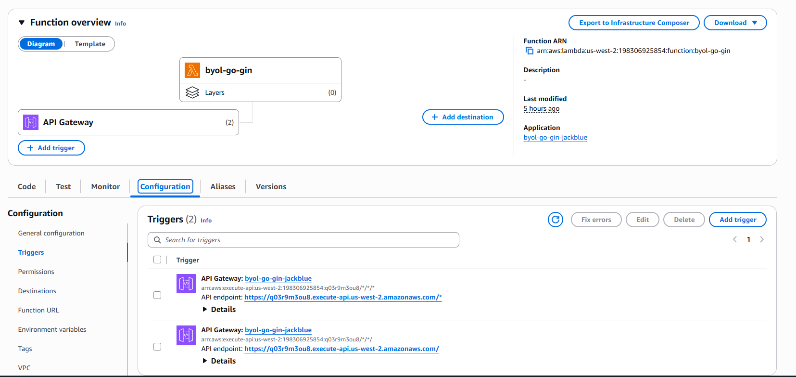

1. Ít đổi code nhất: chỉ thêm main.go ở root + 2 dependencies.
2. Giữ server/server.go sạch ko hề sửa code.
3. Phù hợp với template.yaml hiện tại: BuildMethod: go1.x, HttpApi, PayloadFormatVersion: 2.0.
4. Tận dụng lại Gin route sẵn -> ko phải tự viết manual routing như Option C.
5. Cold start thấp hơn Web Adapter Option B. -> vẫn thua option C
6. Đơn giản nhất dễ handle nhất
7. Cold start estimate = 83.79 ms 

	`REPORT ... Duration: 1.84 ms ... Init Duration: 83.79 ms`	
	
	(ở trong file word ***Personal_lab_evidence.docx***, ảnh cuối cùng) 

---
1. Không hề sửa code ở server/server.go
2. Có tạo mới main.go ở root level
3. Dùng Gin adapter ở main.go
4. Dùng GinLambdaV2 vì theo template.yaml thì đang dùng HTTP API v2
5. Em có chạy thêm go mod tidy lại sai khi thêm dependencies

    	"github.com/aws/aws-lambda-go/events"

	    "github.com/aws/aws-lambda-go/lambda"

`=> go get github.com/aws/aws-lambda-go`

`go get github.com/awslabs/aws-lambda-go-api-proxy/gin`

